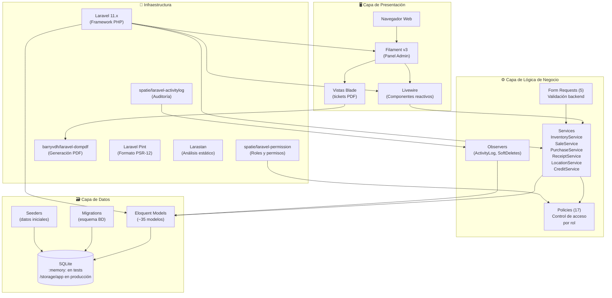
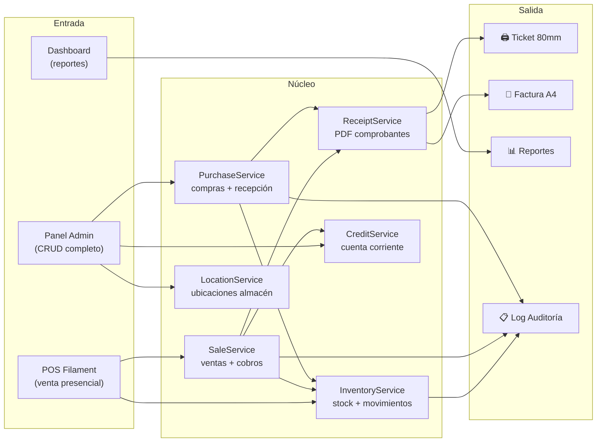
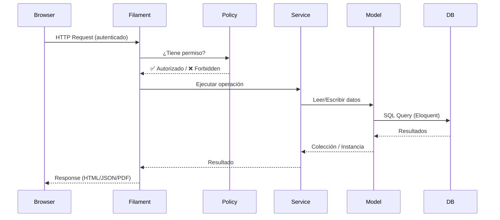

# Arquitectura del Sistema — POS Ferretería

> **Fecha:** 14/03/2026  
> **Metodología:** Kendall & Kendall — Capítulo 9  
> **Referencia:** [Plan Kendall & Kendall — Fase 4](Plan_Kendall_Kendall.md)

---

## Diagrama de Capas

---

## Diagrama de Componentes

---

## Stack Tecnológico

| Capa | Tecnología | Versión |
|---|---|---|
| **Lenguaje** | PHP | 8.3 |
| **Framework** | Laravel | 11.x |
| **Panel Admin** | Filament | v3 |
| **Frontend reactivo** | Livewire | v3 |
| **Base de datos** | SQLite | — |
| **ORM** | Eloquent | (incluido en Laravel) |
| **Roles/Permisos** | spatie/laravel-permission | ^6 |
| **Auditoría** | spatie/laravel-activitylog | ^4 |
| **PDF** | barryvdh/laravel-dompdf | ^3 |
| **Formato código** | Laravel Pint | ^1.24 |
| **Análisis estático** | Larastan | ^3.0 |
| **Tests** | PHPUnit | ^11.5 |

---

## Flujo de Request HTTP

