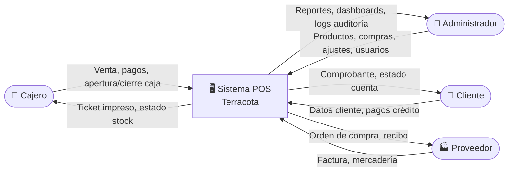
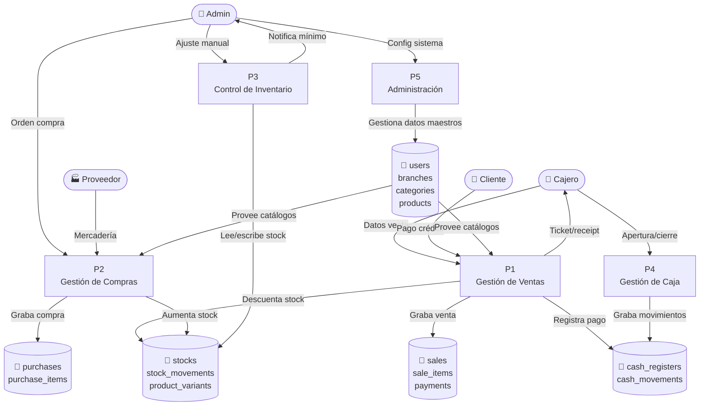
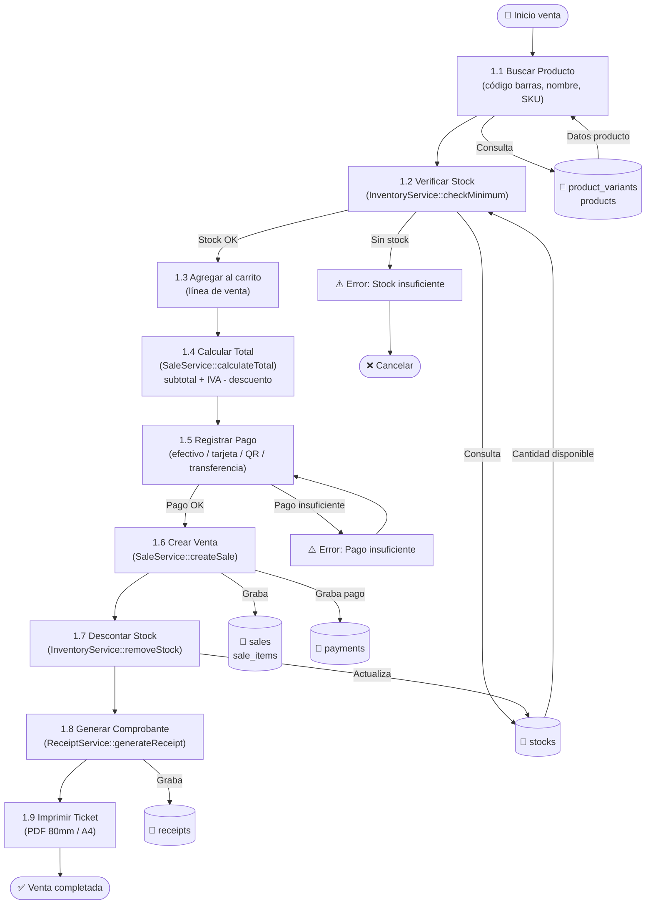
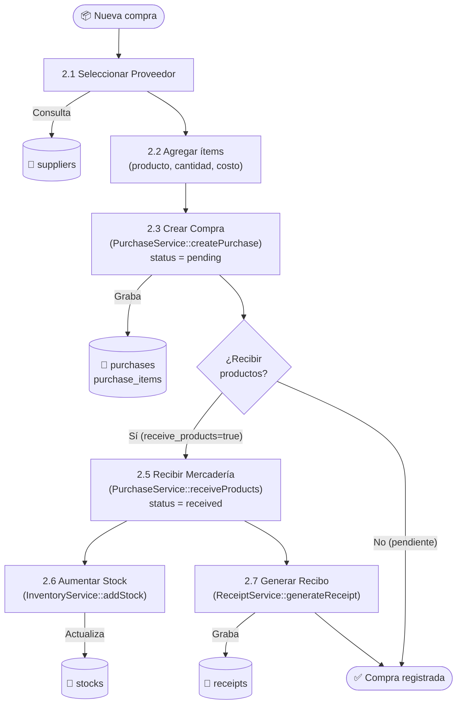

# Diagramas de Flujo de Datos (DFD) — POS Ferretería

> **Fecha:** 14/03/2026  
> **Metodología:** Kendall & Kendall — Capítulos 7-9  
> **Referencia:** [Plan Kendall & Kendall — Fase 4](Plan_Kendall_Kendall.md)

---

## Nivel 0 — Diagrama de Contexto

Muestra el sistema como una caja negra con sus actores externos y los flujos de datos que lo atraviesan.

---

## Nivel 1 — Procesos Principales

Descompone el sistema en sus 5 procesos funcionales principales con sus almacenes de datos.

---

## Nivel 2 — Detalle P1: Flujo de Venta

Descompone el proceso P1 (Gestión de Ventas) en sus subprocesos detallados.

---

## Nivel 2 — Detalle P2: Flujo de Compra

---

## Almacenes de Datos (Data Stores)

| ID | Nombre | Tablas | Descripción |
|---|---|---|---|
| DS1 | Ventas | `sales`, `sale_items`, `payments` | Transacciones de venta y cobros |
| DS2 | Compras | `purchases`, `purchase_items` | Órdenes y recepción de mercadería |
| DS3 | Inventario | `stocks`, `stock_movements`, `product_variants` | Stock actual y movimientos |
| DS4 | Caja | `cash_registers`, `cash_movements` | Operaciones de caja |
| DS5 | Maestros | `users`, `branches`, `categories`, `products`, `customers`, `suppliers` | Datos de configuración |
| DS6 | Comprobantes | `receipts`, `receipt_templates` | PDFs generados |
| DS7 | Ubicaciones | `warehouses`, `warehouse_aisles`, `shelves`, `shelf_rows`, `shelf_levels`, `product_locations` | Estructura física del almacén |
