# Diagrama Entidad-Relación (DER) — POS Ferretería

> **Fecha:** 14/03/2026
> **Referencia:** [Plan Kendall & Kendall — Fase 4](Plan_Kendall_Kendall.md)

---

## DER Completo

```mermaid
erDiagram
    companies {
        id bigint PK
        name string
        ruc string
    }

    branches {
        id bigint PK
        company_id bigint FK
        name string
    }

    users {
        id bigint PK
        name string
        email string
        password string
    }

    categories {
        id bigint PK
        name string
        active boolean
    }

    products {
        id bigint PK
        category_id bigint FK
        name string
        cost_price decimal
        sale_price decimal
        min_stock integer
        tax_percentage decimal
        active boolean
    }

    product_variants {
        id bigint PK
        product_id bigint FK
        name string
        sku string
        barcode string
    }

    warehouses {
        id bigint PK
        branch_id bigint FK
        name string
        is_default boolean
        active boolean
    }

    stocks {
        id bigint PK
        product_variant_id bigint FK
        warehouse_id bigint FK
        quantity integer
    }

    stock_movements {
        id bigint PK
        product_variant_id bigint FK
        warehouse_id bigint FK
        user_id bigint FK
        type string
        quantity integer
        notes text
    }

    warehouse_aisles {
        id bigint PK
        warehouse_id bigint FK
        code string
        description text
    }

    shelves {
        id bigint PK
        warehouse_aisle_id bigint FK
        number string
    }

    shelf_rows {
        id bigint PK
        shelf_id bigint FK
        number string
    }

    shelf_levels {
        id bigint PK
        shelf_row_id bigint FK
        number string
    }

    product_locations {
        id bigint PK
        product_variant_id bigint FK
        shelf_level_id bigint FK
        quantity integer
    }

    customers {
        id bigint PK
        name string
        document string
        phone string
        email string
        is_credit_enabled boolean
        credit_limit decimal
        current_balance decimal
    }

    suppliers {
        id bigint PK
        name string
        ruc string
        phone string
        email string
    }

    sales {
        id bigint PK
        customer_id bigint FK
        user_id bigint FK
        branch_id bigint FK
        cash_register_id bigint FK
        subtotal decimal
        discount decimal
        tax decimal
        total decimal
        status enum
        payment_method enum
        sale_date timestamp
    }

    sale_items {
        id bigint PK
        sale_id bigint FK
        product_variant_id bigint FK
        quantity integer
        price decimal
        discount decimal
        subtotal decimal
    }

    payments {
        id bigint PK
        sale_id bigint FK
        method enum
        amount decimal
        reference string
        payment_date datetime
    }

    customer_payments {
        id bigint PK
        customer_id bigint FK
        sale_id bigint FK
        amount decimal
        date date
        method string
        notes text
    }

    purchases {
        id bigint PK
        supplier_id bigint FK
        user_id bigint FK
        branch_id bigint FK
        warehouse_id bigint FK
        total decimal
        status enum
    }

    purchase_items {
        id bigint PK
        purchase_id bigint FK
        product_variant_id bigint FK
        quantity integer
        cost decimal
    }

    receipts {
        id bigint PK
        sale_id bigint FK
        purchase_id bigint FK
        type string
        number string
        file_path string
        generated_at datetime
    }

    receipt_templates {
        id bigint PK
        name string
        type string
        content_html text
        is_active boolean
    }

    cash_registers {
        id bigint PK
        branch_id bigint FK
        user_id bigint FK
        name string
        opening_amount decimal
        closing_amount decimal
        status string
        opened_at datetime
        closed_at datetime
    }

    cash_movements {
        id bigint PK
        cash_register_id bigint FK
        type string
        amount decimal
        description text
    }

    inventory_adjustments {
        id bigint PK
        product_variant_id bigint FK
        warehouse_id bigint FK
        user_id bigint FK
        old_quantity integer
        new_quantity integer
        reason text
        status enum
    }

    inventory_counts {
        id bigint PK
        warehouse_id bigint FK
        user_id bigint FK
        status enum
        notes text
    }

    inventory_count_items {
        id bigint PK
        inventory_count_id bigint FK
        product_variant_id bigint FK
        system_quantity integer
        counted_quantity integer
        difference integer
    }

    expenses {
        id bigint PK
        expense_category_id bigint FK
        branch_id bigint FK
        user_id bigint FK
        amount decimal
        description text
        expense_date date
    }

    expense_categories {
        id bigint PK
        name string
        active boolean
    }

    %% ── Relaciones ──

    companies ||--o{ branches : "tiene"
    branches ||--o{ warehouses : "tiene"
    branches ||--o{ sales : "registra"
    branches ||--o{ cash_registers : "tiene"
    branches ||--o{ expenses : "registra"

    categories ||--o{ products : "agrupa"
    products ||--o{ product_variants : "tiene"

    warehouses ||--o{ stocks : "almacena"
    warehouses ||--o{ stock_movements : "registra"
    warehouses ||--o{ warehouse_aisles : "organiza"
    warehouses ||--o{ purchases : "recibe"
    warehouses ||--o{ inventory_adjustments : "ajusta"
    warehouses ||--o{ inventory_counts : "cuenta"

    warehouse_aisles ||--o{ shelves : "contiene"
    shelves ||--o{ shelf_rows : "tiene"
    shelf_rows ||--o{ shelf_levels : "tiene"
    shelf_levels ||--o{ product_locations : "ubica"

    product_variants ||--o{ stocks : "tiene"
    product_variants ||--o{ stock_movements : "registra"
    product_variants ||--o{ sale_items : "vendido en"
    product_variants ||--o{ purchase_items : "comprado en"
    product_variants ||--o{ product_locations : "ubicado en"
    product_variants ||--o{ inventory_adjustments : "ajustado"
    product_variants ||--o{ inventory_count_items : "contado"

    users ||--o{ sales : "realiza"
    users ||--o{ stock_movements : "registra"
    users ||--o{ cash_registers : "opera"
    users ||--o{ inventory_adjustments : "ajusta"
    users ||--o{ inventory_counts : "cuenta"
    users ||--o{ expenses : "registra"
    users ||--o{ purchases : "crea"

    customers ||--o{ sales : "compra"
    customers ||--o{ customer_payments : "paga"

    suppliers ||--o{ purchases : "provee"

    sales ||--o{ sale_items : "contiene"
    sales ||--o{ payments : "cobra"
    sales ||--o{ customer_payments : "genera"
    sales ||--o{ receipts : "emite"

    purchases ||--o{ purchase_items : "contiene"
    purchases ||--o{ receipts : "emite"

    cash_registers ||--o{ sales : "registra"
    cash_registers ||--o{ cash_movements : "tiene"

    expense_categories ||--o{ expenses : "clasifica"

    inventory_counts ||--o{ inventory_count_items : "detalla"
```

---

## Leyenda de Cardinalidad

| Símbolo | Significado |
|---|---|
| `\|\|--o{` | Uno a muchos (1:N) |
| `\|\|--\|\|` | Uno a uno (1:1) |
| `o{--o{` | Muchos a muchos (N:M) |

---

## Tablas del Sistema: 35 tablas

| Grupo | Tablas |
|---|---|
| **Base** | companies, branches, users, categories |
| **Productos** | products, product_variants, stocks, stock_movements |
| **Ubicaciones** | warehouses, warehouse_aisles, shelves, shelf_rows, shelf_levels, product_locations |
| **Ventas** | sales, sale_items, payments, receipts, receipt_templates |
| **Clientes** | customers, customer_payments |
| **Compras** | purchases, purchase_items, suppliers |
| **Caja** | cash_registers, cash_movements |
| **Inventario** | inventory_adjustments, inventory_counts, inventory_count_items |
| **Gastos** | expenses, expense_categories |
| **Sistema** | sessions, cache, cache_locks, jobs, job_batches, failed_jobs, password_reset_tokens |
